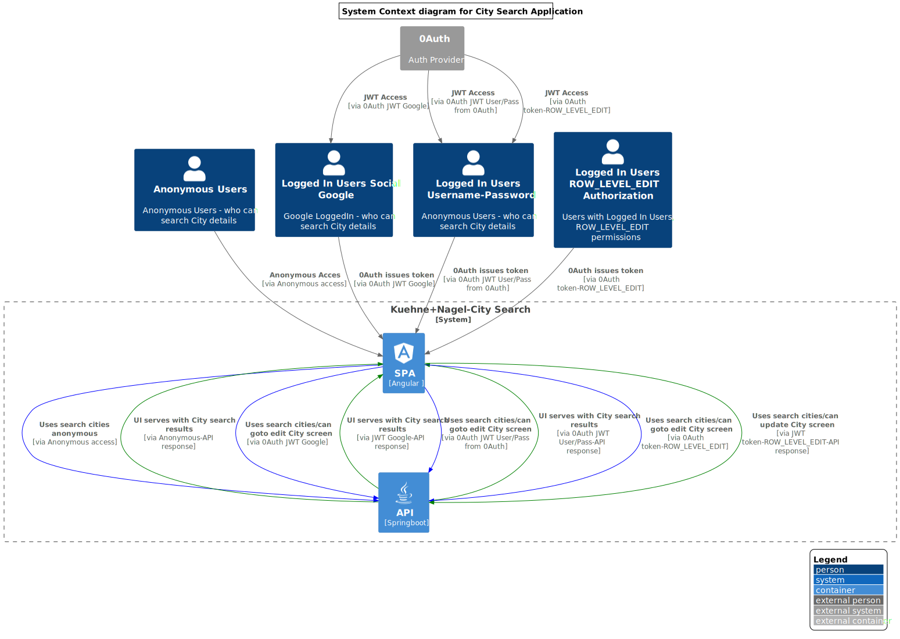
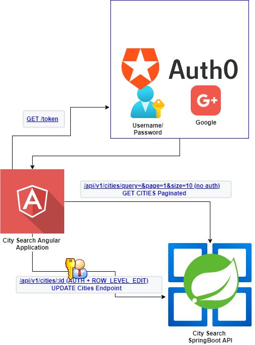

## Kuehne + Nagel City Search

City Search Applicaiton is SpringBoot API + Angular Application
Authentication is acheieved through 0Auth Provider -Free tier , so only 1000 tokens/month
City Searh API - works with anonymous access
City Updated API- works with Logged In Users with Role: ROW_LEVEL_EDIT


### 1. Architecture - C4 System Diagram


### 2. Architecture - Flow Diagram


### 3. Live Demo
API & UI Deployed to Heroku API(postgres+api) & UI(angular)

API: https://city-search-api-springboot.herokuapp.com/swagger

UI: https://city-search-ui-angular.herokuapp.com/


### 4. Build & Run in Local

#### 4.1. Build API - Project

##### 4.1.1 Prerequisites:
1. Java

>Java version "17.0.4" 2022-07-19 LTS
>Java(TM) SE Runtime Environment (build 17.0.4+11-LTS-179)
>Java HotSpot(TM) 64-Bit Server VM (build 17.0.4+11-LTS-179, mixed mode, sharing)


2. Postgres 
please check the connection string in application.properties
make sure update  **DATABASE_URL** and database should be created in Local PG Server

  >spring.datasource.url=jdbc:postgresql://localhost:5432/kryptontest?reWriteBatchedInserts=true
  
  >spring.datasource.username= <usrname>
  
  >spring.datasource.password=<Pasword>

>jdbc:postgresql://localhost:5432/krypton?reWriteBatchedInserts=true```


```
cd api
./gradlew build
./gradlew bootrun
```


API serves at http://localhost:9050/swagger-ui/index.html


```
curl -X 'GET' \
  'http://localhost:9050/api/v1/cities?page=1&size=10' \
  -H 'accept: */*'
```

##### 4.1.2 Test Porject

for Testing 
update the application.properties in test pacakge

  >spring.datasource.url=jdbc:postgresql://localhost:5432/kryptontest?reWriteBatchedInserts=true
  
  >spring.datasource.username= <usrname>
  >spring.datasource.password=<Pasword>


>jdbc:postgresql://localhost:5432/kryptontest?reWriteBatchedInserts=true```

```
cd api
./gradlew build
./gradlew test

```

#### 4.2 Build Angular Project

##### 4.2.1 Prerequisites:

1. Angular / Node/ NPM

>Angular CLI: 12.0.4
Node: 16.16.0
Package Manager: npm 8.11.0

in PROD using npm start  - serve from Express

but in local npm run start-local


```
cd ui
npm install
ng build --configuration development
npm run start-local

```


### 5. Improvements

1. As  mentioned in the Problem statement to support Enterprise Search functionalities I will be looking at the Elastic Search to server Search but Ingesting the data in Reational/NOSQL Databases.

2. Adding Cities into System through Event Driven - KAFKA/Azure EventHub which will ingest truth of source in Postgres/MongoDB , updated elastic search index based on that

    KAFKA =>cityInformation===> POSTGRES/MONGODB ==> update elastic Search

    ALL UI apps will be serving from Elsatic search endpoint proxied via Springboot

